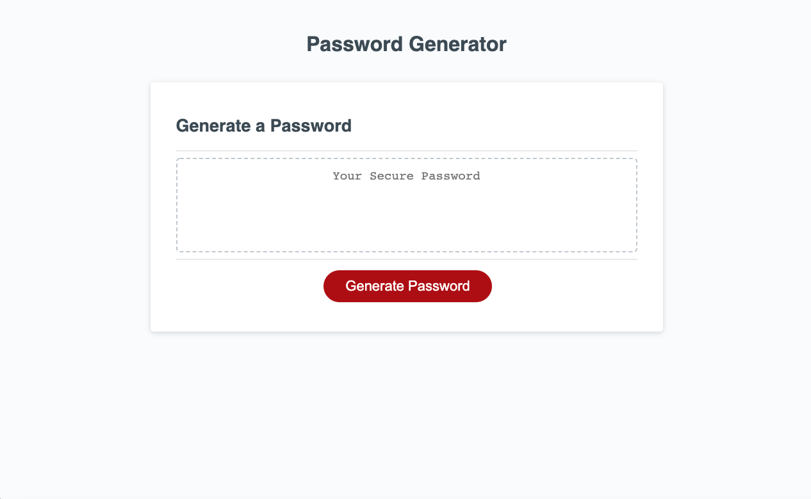

# Password-Generator

https://burnsgirl.github.io/Password-Generator/
https://github.com/burnsgirl/Password-Generator

I have developed a website that generates random passwords based on the user input to the prompts. I have made strings to use to randomize the characters. I used the if statements to take in the user input to decide what needs to be incorporated in the password. Then after all the user data is gather, the next function uses it to randomize the results and then the password appears in the password box.